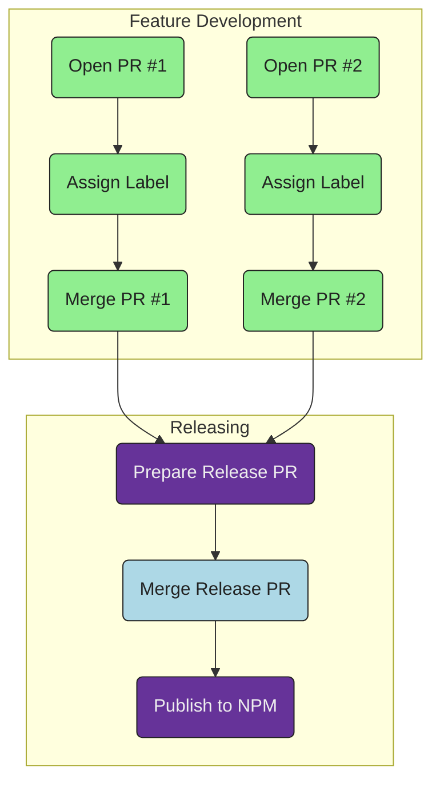

# Release Workflow

`release-plan` reduces friction for new contributors (regardless of how new to
GitHub they are) as well releases for maintainers.

- **Contributors**: Open PRs as usual, assign a label and merge as usual :v:
- **Maintainers**: Inspect the next release (previewed in a PR), then merge when you
  are happy and a new release will be published
- **Automation**: `release-plan` automates the preview and publishing of
  releases

::: info

No need for maintainers to manage any keys locally on their machine.
`release-plan` takes the step encourages separate management of repo and npm package.

:::

