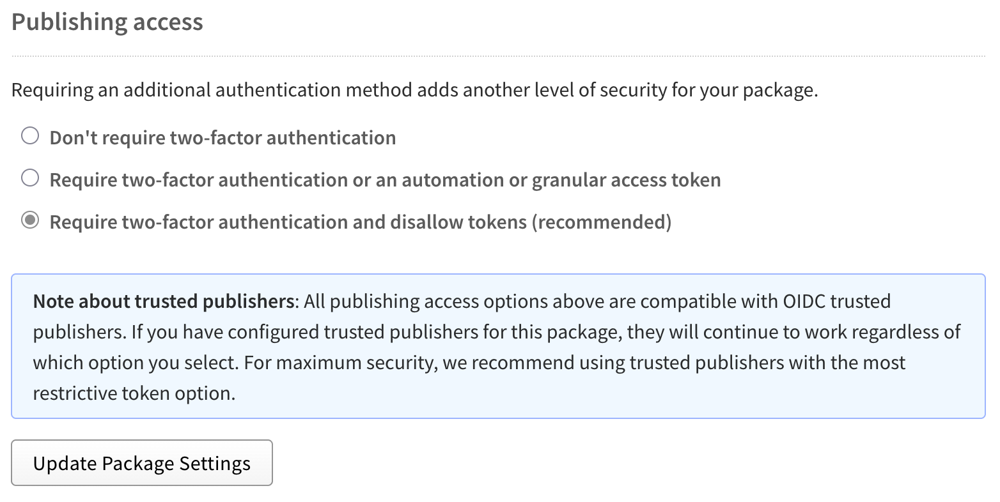

# Trusted Publishing

Trusted Publishing allows you to publish npm packages directly from your CI/CD
workflows using OpenID Connect (OIDC) authentication - the exact workflow
`release-plan` was designed for and naturally supports out of the box.

## Github Setup

A little setup change is needed to enable trusted publishing with Github.

### Prerequisites

- Enable 2FA in your NPM Account
- [Enable 2FA in your Github Account](https://github.com/settings/security)

### Setup NPM

Add a trusted publisher for your package on NPM. Navigate to settings on your
package and select Github Actions as your CI/CD provider:


Configure the following fields:

- **Organization or user** (required): Your GitHub username or organization name
- **Repository** (required): Your repository name
- **Workflow filename** (required): The filename of your workflow (e.g., `publish.yml`)
  - Enter only the filename, not the full path
  - Must include the `.yml` or `.yaml` extension
  - The workflow file must exist in `.github/workflows/` in your repository
- **Environment name** (optional): If using GitHub environments for deployment protection


Require two-factor authentication and disallow tokens (recommended) for
publishing access.



### Setup Github

Minimal changes for Github Actions.

#### CI Pipeline

To use trusted publishing, `npm@v11.5.1` or later is required. Update your installed `npm` to
the latest:

```yml [.github/workflows/publish.yml]
# For every push to the primary branch with .release-plan.json modified,
# runs release-plan.

name: Publish Stable

on:
  workflow_dispatch:
  push:
    branches:
      - main
      - master
    paths:
      - '.release-plan.json'

concurrency:
  group: publish-${{ github.head_ref || github.ref }}
  cancel-in-progress: true

jobs:
  publish:
    name: "NPM Publish"
    runs-on: ubuntu-latest
    permissions:
      contents: write
      id-token: write
      attestations: write

    steps:
      - uses: actions/checkout@v4
      - uses: pnpm/action-setup@v4
      - uses: actions/setup-node@v4
        with:
          node-version: 22
          # This creates an .npmrc that reads the NODE_AUTH_TOKEN environment variable
          registry-url: 'https://registry.npmjs.org'
          cache: pnpm
      - run: pnpm install --frozen-lockfile
      # we are doing this to make sure theat the gloabally installed npm is new enough to support OIDC // [!code ++]
      - name: Install latest npm (for Trusted Publishing) # [!code ++]
        run: npm install -g npm@latest # [!code ++]
      - name: Publish to NPM
        run: NPM_CONFIG_PROVENANCE=true pnpm release-plan publish
        env:
          GITHUB_AUTH: ${{ secrets.GITHUB_TOKEN }}
      
```

#### Secrets & Variables

Navigate to `Settings > Secrets & Variables > Actions`:

- Remove all unnecessary repository secrets (e.g. npm tokens, as OIDC can be
  used instead)

## Resources

- [Strengthening npm security: Important changes to authentication and token
  management](https://github.blog/changelog/2025-09-29-strengthening-npm-security-important-changes-to-authentication-and-token-management)
- [Trusted publishing for npm
  packages](https://docs.npmjs.com/trusted-publishers)
- [Best Practices on Publishing npm
  Packages](https://e18e.dev/docs/publishing.html#setting-up-the-github-repository)
